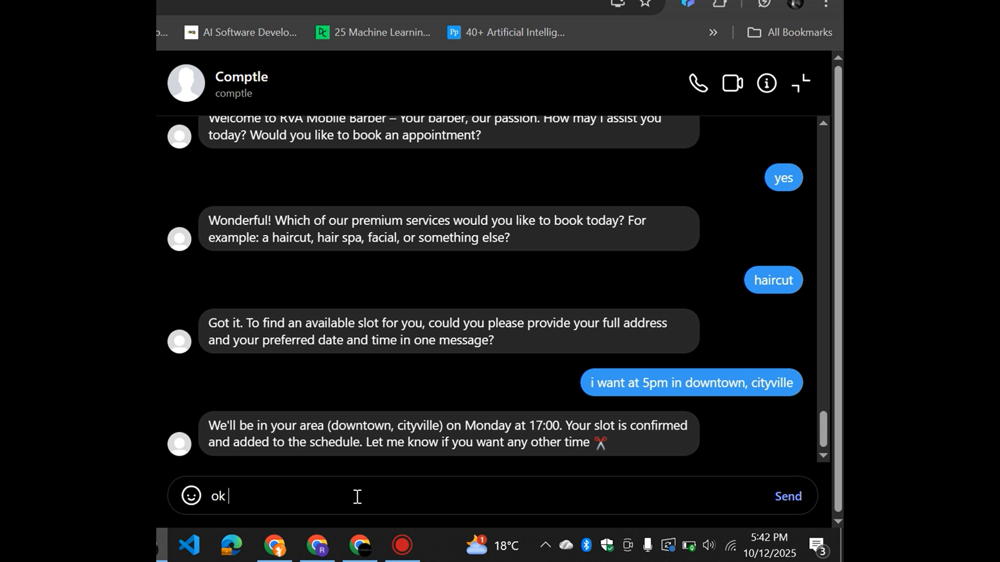
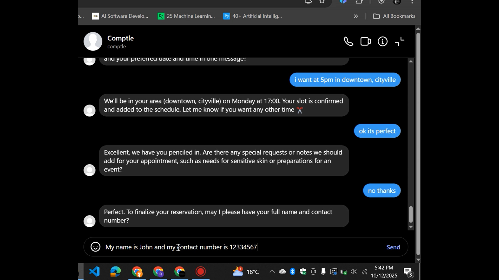
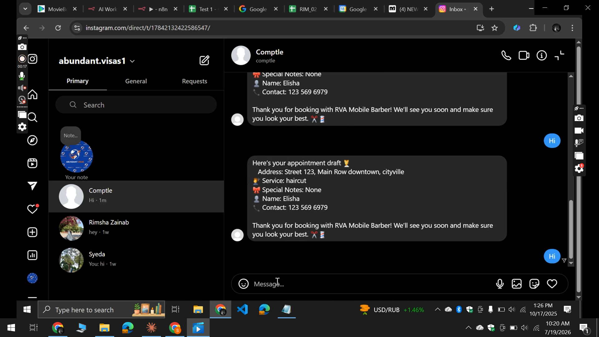

# AI Instagram Booking Assistant

An AI-powered Instagram Booking Assistant built using **ManyChat, n8n, OpenAI, and Google Calendar** that automates appointment scheduling for barbers and other service-based businesses.

Instead of manually replying to Instagram DMs, checking availability, scheduling appointments, and sending reminders, the entire booking process is handled automatically through AI.

> **Note:** The original workflow JSON is intentionally not included because it was developed for a client. This repository demonstrates the workflow architecture, execution, and results while protecting client confidentiality.

---

# Business Problem

Many service-based businesses still manage appointments manually through Instagram DMs.

This often leads to:

- Missed customer messages
- Double bookings
- Time-consuming scheduling
- Human errors
- No appointment reminders
- Poor customer experience

Business owners spend hours every week managing conversations instead of serving customers.

---

# Solution

This workflow transforms Instagram into an intelligent booking assistant.

When a customer sends a message, the AI understands their booking request, checks availability, finds an appointment slot, schedules it automatically, creates the event in Google Calendar, and confirms the booking—all without human intervention.

If the requested day is fully booked, the assistant automatically searches for the next available slot and offers it to the customer.

---

# Workflow Features

- Instagram DM automation using ManyChat
- AI-powered booking intent detection
- Conversational appointment booking
- Customer information collection
- Intelligent availability checking
- Automatic 1-hour appointment scheduling
- Area-based scheduling logic
- Google Calendar integration
- Appointment confirmation
- Appointment reminders
- Rescheduling support
- Follow-up customer messages
- Error handling

---

# Workflow Architecture


---

# How the Workflow Works

```
Instagram Customer

        │

        ▼

ManyChat Trigger

        │

        ▼

OpenAI Agent

(Intent Detection)

        │

        ▼

Collect Customer Details

        │

        ▼

Availability Check

        │

        ▼

Find Available Time Slot

        │

        ▼

Google Calendar

(Create Appointment)

        │

        ▼

Booking Confirmation

        │

        ▼

Reminder Automation

        │

        ▼

Follow-up Messages
```

---

# Example Workflow

1. Customer sends a message on Instagram.

2. ManyChat forwards the conversation to n8n.

3. AI determines whether the customer wants to book an appointment.

4. The assistant asks for:

- Preferred day
- Preferred location
- Preferred time

5. The workflow checks Google Calendar availability.

6. If a slot is available:

- Appointment is created
- Confirmation message is sent

7. If unavailable:

- Next available slot is automatically suggested.

8. Reminder messages are sent before the appointment.

9. Follow-up messages are sent after the appointment.

---

# Tech Stack

### Automation

- n8n
- ManyChat

### AI

- OpenAI
- Large Language Models (LLMs)

### Calendar

- Google Calendar API

### APIs

- REST APIs

### Programming

- JavaScript

---

# Business Impact

This automation helps businesses by:

- Reducing manual work
- Eliminating scheduling conflicts
- Responding instantly to customers
- Increasing booking efficiency
- Reducing missed appointments
- Improving customer satisfaction
- Keeping Google Calendar automatically updated

---

# Repository Contents

```
assets/
│
├── workflow.png
├── Workflow_execution.mp4
├── Workflow_explanation_part1.mp4
├── Workflow_explanation_part2.mp4
├── final_execution.mp4
├── output1.png
├── output2.png
└── output3.png

README.md
```

---

# Workflow Demonstration

## Workflow Overview

📹 `assets/Workflow_explanation_part1.mp4`

Explains the first part of the workflow, AI logic, and booking architecture.

---

## Workflow Logic

📹 `assets/Workflow_explanation_part2.mp4`

Covers appointment scheduling, calendar integration, and booking logic.

---

## Complete Workflow Execution

📹 `assets/Workflow_execution.mp4`

Shows the complete automation running inside n8n.

---

## Final End-to-End Demo

📹 `assets/final_execution.mp4`

Demonstrates the customer experience from Instagram message to confirmed appointment.

---

# Workflow Outputs

### Booking Confirmation



---

### Calendar Appointment



---

### Customer Conversation



---

# Privacy Notice

This repository intentionally **does not include the original n8n workflow JSON** because it was developed for a real client.

Only architecture diagrams, demonstrations, screenshots, and documentation are shared to showcase the solution while respecting client confidentiality.

---

# Author

**Rimsha Zainab**

AI Automation Engineer

**Specializations**

- n8n Automation
- AI Agents
- Workflow Automation
- OpenAI
- ManyChat
- Google Workspace Automation
- Python
- Playwright
- API Integrations

LinkedIn:
https://linkedin.com/in/rimsha-zainab-9b273628b

GitHub:
https://github.com/Rimsha13
